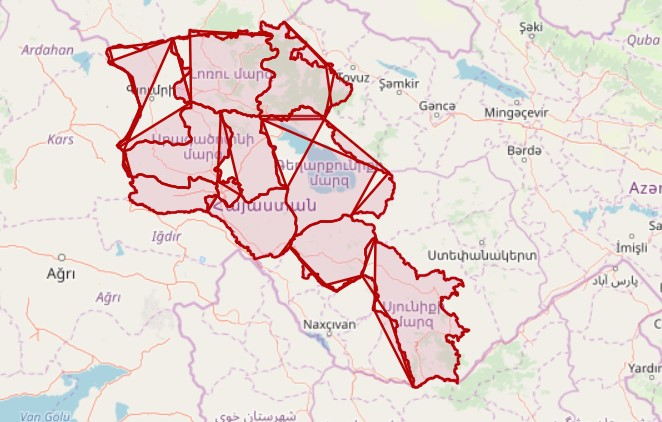
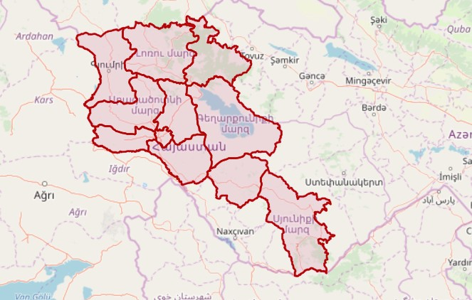
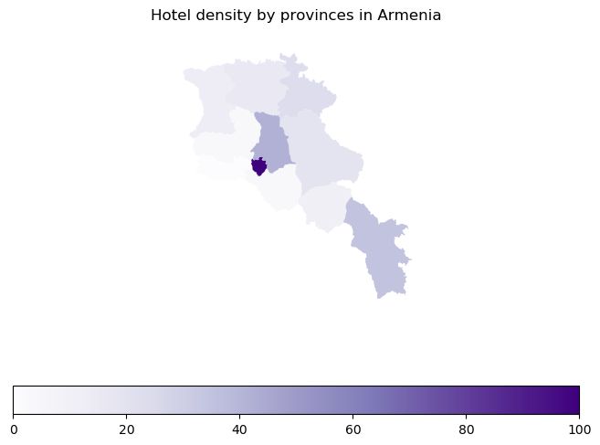
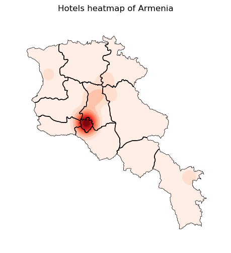

# Understanding the scattering of hotels in Armenia
## Using Overpass API, Geopandas and Geoplot, while facing and solving some interesting problems along the way

Codding and debugging process takes long, and every time hitting the debug button sent overpass queries, overloading the servers. So after a while, the server blocked my IP for some time, considering the requests suspicious. Basically, no changes were made on the server every time the requests were made, so there was no need to get newer data. 

The solution was simple: writing the results of requests to files and updating it, when necessary, while doing the parsing offline only.
```python
def update_source(source_type="hotels"):
```
functions came up. Using requests solved encoding problem (as there are some letters in local language, which need to be encoded in utf-8 format).

***

After parsing the borders of provinces a new problem came up! Using the [WKT Playgroung Project](https://clydedacruz.github.io/openstreetmap-wkt-playground/), we see some polygon deformation

The problem is caused for two reasons:
1.   Border start and end points sometimes were reversed (endpoint of a border was not a startpoint for the next one)
2.   Border order messed up (borders were mainly in clockwise order, but some of them were just in a random place)



We deal with these two problems with the help of these functions:
```python
def coordinate_mess_fixer(all_coords):
```
this iterates over the borders, and if two neighboring borders don't have any start/end point in common, looks for one, which has and replaces the isolated one with the one found afterwards.

At this point we have neighboring borders, which have either start or end points in common. Now we need to fix the point order.

```python
def border_order_fixer(all_coords):
```
this iterates over the borders, and if the start point of the current one is not the endpoint for the previous one, just reverses it.

Finally we got this:



***

Using shapely `Point.within(Polygon)` method, we get the provinces, a hotel is in.

Going further, we create GeoDataFrames from hotels and provinces (added hotel density column) and plot using
`choropleth`



and `kdeplot`



***
This gives a basic idea of hotel placements/competitor density in the country and may become a starting point for further market analysis.
